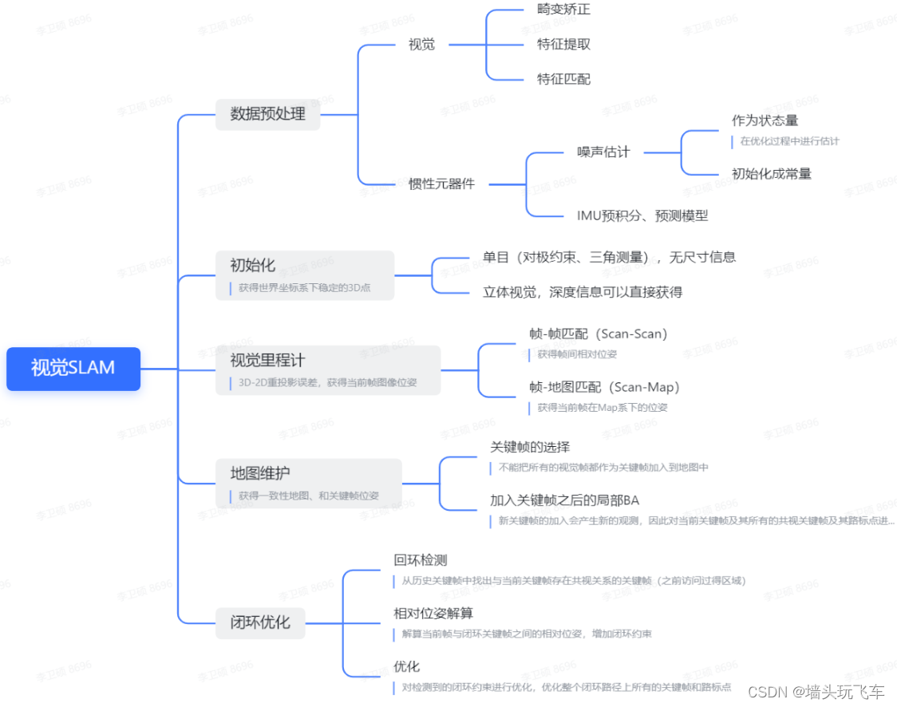

# GCNv2_SLAM_Yolov10
记录论文实验过程中完整的思路发展，以及一路遇到的问题及解决方案。Linux下C++开发。

## 目录

  - 视觉SLAM
  - VMware虚拟机Linux系统分区扩容方法
  - VMware普通版虚拟机不支持显卡直连，因而无法使用CUDA和CuDNN，只能安装CPU版，推理Windows系统中的GPU版训练的模型
  - 使用CMake-GUI进行多版本依赖安装
  - 在项目中添加自定义路径的第三方库，通过修改CMakeLists.txt并重新编译的实现，让主项目和非主项目的源代码文件均能调用（C++编程技巧：Pimpl思想）
  - 自己编译自定义的C++库为单独的库文件
  - 解决terminate called without an active exception Aborted (core dumped)未知错误。使用Linux自带的gdb工具来运行程序，分析内存相关的程序中途崩溃的原因，分析生成的core文件，使用更全面的工具valgrind来分析内存的使用情况。
  - 安装ORB-SLAM3和ORB-SLAM2（Ubuntu）
    - 安装ORB-SLAM2，主要是因为GCNv2_SLAM自带ORB-SLAM2
  - 使用ORB-SLAM3和GCNv2_SLAM
    - 测试ORB-SLAM3
    - 测试GCNv2_SLAM
  - 为Yolo配置环境并下载Yolo
  - ORB-SLAM3与Yolo相结合
    - 代码逻辑
  - 测试算法精度，获得确切的表格数据
  - 卡尔曼滤波

## 视觉SLAM



## VMware虚拟机Linux系统分区扩容方法

使用`df -h`来查看硬盘的名字和大小，或使用`df -h 文件夹`来查看特定的文件夹所属的硬盘的名字和大小。

扩容前最好建立系统快照，因为分区扩容可能会造成数据丢失或出现各种问题：


系统自带的Disks工具，必须先在上面的扩容部分设置扩容量（文件系统的大小的最大值），然后在下面的文件系统进行实际的扩容。


完成后需要重启。

## VMware普通版虚拟机不支持显卡直连，因而无法使用CUDA和CuDNN，只能安装CPU版，推理Windows系统中的GPU版训练的模型

不支持显卡直连，不可以安装英伟达驱动。检查是否有安装驱动：

`nvidia-smi`

若没有安装英伟达驱动，终端会打印驱动安装的指令：


选择任何版本进行安装，都会造成报错，因为虚拟机的显卡本质上是一个虚拟显卡，和英伟达没关系。正常的安装方法：

`sudo apt install nvidia-utils-535`

## 使用CMake-GUI进行多版本依赖安装

Ubuntu20.04，在默认的usr/local已经安装了OpenCV4.2.0，用于编译ORB-SLAM3。而现在需要编译GCNv2_SLAM（基于ORB-SLAM2），需要OpenCV3.4.5，C++的编译可以通过CMake来指定编译时用到的依赖库的路径，以实现同一操作系统下编译需要不同版本的依赖库C++项目，但前提是不同版本的依赖库都有安装在同一操作系统下且互不冲突。通过系统自带的包管理工具（直接apt-get）安装和通过源码安装但使用的是CMake进行编译安装，对依赖库的安装均默认在系统的usr/local路径下，会覆盖掉已安装的不同版本的依赖库，而仅通过命令行版本的CMake较难设置安装路径，因此需要使用CMake-GUI来图形化地设置安装路径，方便将多个依赖库版本安装在不同的路径下，以实现类似虚拟环境的效果。

默认源系统更新速度很慢，更换清华源：

```
sudo cp /etc/apt/sources.list  /etc/apt/sources.list.bak # 备份

sudo gedit /etc/apt/sources.list # 删除全部内容更换清华源
```

通过网址https://mirrors.tuna.tsinghua.edu.cn/help/ubuntu/ ，更换Ubuntu 20.02对应的清华源：

```
# 默认注释了源码镜像以提高 apt update 速度，如有需要可自行取消注释
deb https://mirrors.tuna.tsinghua.edu.cn/ubuntu/ focal main restricted universe multiverse
# deb-src https://mirrors.tuna.tsinghua.edu.cn/ubuntu/ focal main restricted universe multiverse
deb https://mirrors.tuna.tsinghua.edu.cn/ubuntu/ focal-updates main restricted universe multiverse
# deb-src https://mirrors.tuna.tsinghua.edu.cn/ubuntu/ focal-updates main restricted universe multiverse
deb https://mirrors.tuna.tsinghua.edu.cn/ubuntu/ focal-backports main restricted universe multiverse
# deb-src https://mirrors.tuna.tsinghua.edu.cn/ubuntu/ focal-backports main restricted universe multiverse

# 以下安全更新软件源包含了官方源与镜像站配置，如有需要可自行修改注释切换
deb http://security.ubuntu.com/ubuntu/ focal-security main restricted universe multiverse
# deb-src http://security.ubuntu.com/ubuntu/ focal-security main restricted universe multiverse

# 预发布软件源，不建议启用
# deb https://mirrors.tuna.tsinghua.edu.cn/ubuntu/ focal-proposed main restricted universe multiverse
# # deb-src https://mirrors.tuna.tsinghua.edu.cn/ubuntu/ focal-proposed main restricted universe multiverse
```

CMake-GUI是较老的包，安装前需要先更新系统：

```
sudo apt-get update
sudo apt-get upgrade
```

安装CMake_GUI：

`sudo apt install cmake-qt-gui`

安装OpenCV 3.4.5的依赖包：

```
sudo apt-get install build-essential
sudo apt-get install cmake git libgtk2.0-dev pkg-config libavcodec-dev libavformat-dev libswscale-dev
sudo apt-get install python-dev python-numpy libtbb2 libtbb-dev libjpeg-dev libpng-dev libtiff-dev libjasper-dev libdc1394-22-dev
```

下载OpenCV 3.4.5和OpenCV_contrib 3.4.5源码压缩包并解压在喜欢的路径下（之后会安装到源码路径下），在OpenCV 3.4.5源码文件夹下新建一个文件夹build，在命令行cd到此文件夹路径下，使用`cmake-gui ..`打开CMake-GUI，源码路径和生成build文件路径一般会自动分别选择为OpenCV 3.4.5源码文件夹路径和刚新建的build文件夹路径。而配置文件一栏是空的。


点击左下角的Configure，按以下配置：


点击finish，开始下载和生成build文件，中途可能会卡死（下载xfeatures2d相关依赖的网络问题，也可以自己去其他地方下载缺失的文件，放置到OpenCV_contribute源代码下的`modules/xfeatures2d/src`），通过点击Stop然后重新点击Configure来继续下载和生成build文件，直到配置文件全部下载和生成完毕：


编辑配置文件，以更改不同版本的依赖库安装的路径：

- CMAKE_BUILD_TYPE 值处输入RELEASE

- CMAKE_INSTALL_PREFIX 把默认安装目录更改为喜欢的路径，可以直接在新建的build文件夹下新建一个文件夹（此处命名为installed较为直观）来作为安装路径，安装在源码下，方便管理。


- 拓展模块编译才需要的设置：OPENCV_EXTRA_MODULES_PATH 选择OpenCV_contrib 3.4.5源码中的modules文件夹。OPENCV_EXTRA_MODULES_PATH 是用来指定要编译的扩展模块，其中包括OpenCV_contrib模块。


然后点击左下角的Generate生成配置文件，可能会卡死（下载xfeatures2d相关依赖的网络问题，也可以自己去其他地方下载缺失的文件，放置到OpenCV源代码下的`.cache/xfeatures2d`下分别放置到新建或已有的boostdesc和vgg文件夹），然后在build文件夹目录下打开终端命令行执行`make -j`开始编译，然后执行`sudo make install`进行安装。中途若编译时需要的依赖版本过高或过低，则和安装OpenCV的上述流程一样安装一个不同版本的即可。

1.编译中可能出现找不到cuda文件等问题，把`INCLUDE_DIRECTORIES("/home/user/3rdParty/opencv3.4.5/opencv_contrib-3.4.5/modules/xfeatures2d/include")`（也就是OpenCV_contribute源代码下的`modules/xfeatures2d/include`）添加到OpenCV源代码下的`modules`和`modules/stitching`的CMakeLists.txt的文件开头。

2-3.编译中下载极其慢的主要两个（ippicv_2019_lnx_intel64_general_20180723和face_landmark_model.dat，可以硬等，10分钟左右），也可以通过本地下载的方式（需要修改CMake相关文件来更换下载方式）。

安装完成后需要配置环境变量以避免多个版本的OpenCV冲突。

添加库路径，创建opencv.conf文件：`sudo gedit /etc/ld.so.conf.d/opencv.conf`，将实际安装路径下的lib文件夹路径在文件末尾进行添加
`/home/3rdparty/opencv3.4.5/opencv-3.4.5/build/installed/lib`。

添加环境变量`sudo gedit ~/.bashrc
`，将实际安装路径下的lib文件夹路径在文件末尾进行添加：

```
export PKG_CONFIG_PATH=${PKG_CONFIG_PATH}:/home/user/3rdParty/opencv3.4.5/opencv-3.4.5/build/installed/lib/pkgconfig`和`
export LD_LIBRARY_PATH=${LD_LIBRARY_PATH}:/home/user/3rdParty/opencv3.4.5/opencv-3.4.5/build/installed/lib
```

将默认的OpenCV版本改为新安装的版本（若需要使用已安装版本则注释掉这两句并更新环境变量）。

`source ~/.bashrc`更新环境变量，`sudo ldconfig`更新库缓存，`pkg-config --modversion opencv`查询默认的OpenCV版本。通过`pkg-config --modversion opencv4`查询已安装的默认的OpenCV4版本。

需要OpenCV进行编译的项目，需要通过指定CMakeList中find_packages前添加CMAKE_PREFIX_PATH路径来指定并非在系统默认路径安装的OpenCV版本。`set(CMAKE_PREFIX_PATH "/home/user/3rdParty/opencv3.4.5/opencv-3.4.5/build/installed")`

## 在项目中添加自定义路径的第三方库，通过修改CMakeLists.txt并重新编译的实现，让主项目和非主项目的源代码文件均能调用（C++编程技巧：Pimpl思想）

```
# 设置CMake的最低版本（一般CMakeLists.txt里自带）
cmake_minimum_required(VERSION 3.10)

# 项目名称（一般CMakeLists.txt里自带）
project(MyProject)

# 查找并链接第三方库（与设置库目录作用相同），同时设置MYLIB_LIB1这个变量，是名为third_party123的第三方库。
find_library(MYLIB_LIB1 NAMES third_party123 HINTS 第三方库/libthird_party123.so文件的路径)

# 设置库目录和头文件目录（若是只有头文件的库，则只需要设置头文件目录即可，不需要查找并链接第三方库或设置库目录）
link_directories(第三方库/libthird_party123.so文件的路径)
include_directories(第三方库/include的路径)

# 设置将会被编译为可执行文件的主项目代码文件
add_executable(your_target_name 主项目代码文件的相对路径)

# 链接第三方库，可以一句里链接多个
target_link_libraries(your_target_name ${MYLIB_LIB1})
```

示例：1.GCNv2_SLAM项目的某一个将被编译为可执行文件（含有main函数，主项目）的代码文件rgbd_gcn.cc中添加onnxruntime库来部署yolo模型。2.GCNv2_SLAM项目的某一个自定义的共享库（不包含main函数）的代码文件Tracking.cc中添加onnxruntime库来部署yolo模型。三步编译检查：整个项目成功编译（第三方库链接关系通过），并且在能够仅增加include了onnxruntime库的情况下成功编译（头文件编译通过），且能够跑通包含了onnxruntime库的代码编译为的可执行文件（源文件成功执行），才算是完全编译成功。所需要对CMakeLists.txt进行的修改：

```
# 原来的末尾内容（原作者为了在ORB-SLAM2的所有共享库和可执行文件rgbd_gcn.cc中导入GCNv2相关的第三方库libtorch，所编辑的CMakeLists.txt文件的末尾内容）：

set(CMAKE_RUNTIME_OUTPUT_DIRECTORY ${PROJECT_SOURCE_DIR}/GCN2)

target_link_libraries(rgbd_gcn ${PROJECT_NAME} ${TORCH_LIBRARIES})

add_executable(rgbd_gcn GCN2/rgbd_gcn.cc)

set_property(TARGET rgbd_gcn PROPERTY CXX_STANDARD 11)

# 先不关注所有共享库，仅为可执行文件rgbd_gcn.cc导入第三方库onnxruntime的所需修改内容：

# 设置可执行文件输出目录
set(CMAKE_RUNTIME_OUTPUT_DIRECTORY ${PROJECT_SOURCE_DIR}/GCN2)

# libonnxruntime.so在/home/user/onnxruntime/onnxruntime/build/Linux/Release路径下，库目录以.so文件为准。
find_library(ONNXRUNTIME_LIBRARY NAMES onnxruntime HINTS /home/user/onnxruntime/onnxruntime/build/Linux/Release)
include_directories(/home/user/onnxruntime/onnxruntime/include)

# 将主项目代码文件编译为可执行文件。创建了一个名为rgbd_gcn的TAEGET，可用于后面强制指定C++标准。
add_executable(rgbd_gcn GCN2/rgbd_gcn.cc)

# 已链接libtorch第三方库，添加${ONNXRUNTIME_LIBRARY}来链接onnxruntime第三方库。
target_link_libraries(rgbd_gcn ${PROJECT_NAME} ${TORCH_LIBRARIES} ${ONNXRUNTIME_LIBRARY})

# 当rgbd_gcn.cc中include了onnxruntime库，编译才有报错，发现是因为1.20.0版本的onnxruntime的接口的编译需要C++17以上的标准，因此强制指定可执行文件的C++标准（与其他共享库无关）。注意GCNv2_SLAM默认使用C++11的标准。
# 注意这只设定了主项目源代码文件编译为可执行文件时C++标准，其他主项目调用的源代码文件或共享库编译的C++标准可以是不同的，并没有强制指定。
set_property(TARGET rgbd_gcn PROPERTY CXX_STANDARD 17)
# 或者使用：target_compile_features(rgbd_gcn PUBLIC cxx_std_17) 能达成相同的效果。

# 要注意的是，在GCNv2_SLAM项目中，作为主项目代码文件rgbd_gcn.h和rgbd_gcc.cc并没有调用其他编译时会与C++17标准相冲突的共享库或第三方库的接口，因此可以通过上述的方法直接将onnxruntime库的接口链接到主项目代码文件中并参与可执行文件的编译。但是，在GCNv2_SLAM项目中，作为非主项目代码文件，例如Tracking.cc，大多调用了其他编译时会与C++17标准相冲突的共享库或第三方库的接口，若直接导入onnxruntime库的接口，则编译标准相冲突必定失败，因此需要通过分离编译或预编译为第三方库的方式来间接调用onnxruntime库的接口。
# 因此，如果想在某一个源代码文件中导入第三方库，但与其已经导入的第三方库C++标准不同，那么是不可能编译成功的。
# CMake中，并非C++中，目标（Target/TARGET）可以是可执行文件（对应add_executable()单个主项目源代码文件）、静态库（对应add_library(... STATIC ...)全部源代码文件为整体）、共享库（对应add_library(... SHARED ...)全部源代码文件为整体）、模块库（对应add_library(... MODULE ...)全部源代码文件为整体）。静态库不能被多个可执行文件同时调用，而动态库可以。强制指定C++标准，需要对TAEGET进行操作，而不是对单个源代码文件进行操作，因为编译标准适用的最小单位是一个可执行文件或一个库。

# 采用单源代码文件分离编译（实质上是失败方案，因为即使编译通过了，想要让单个源代码文件而不是预编译库与整个项目链接，实际上还是需要遵循统一的编译标准）：

# 添加自定义共享库（onnx_model.cc），将其转化为一个TAEGET，并强制指定C++标准。
add_library(onnx_model SHARED src/onnx_model.cc)
target_compile_features(onnx_model PUBLIC cxx_std_17)
# 添加${ONNXRUNTIME_LIBRARY}来链接onnxruntime第三方库，如果还需要其他第三方库也可以在这里加上。
target_link_libraries(onnx_model ${ONNXRUNTIME_LIBRARY})
# 如果onnx_model的头文件和源文件导入了onnxruntime库，而其他共享库没有导入onnx_model，则上述的CMake代码已经可以让编译通过。
# 但是如果要让其他共享库导入onnx_model而且能够编译成功，那么onnx_model的头文件就不能导入onnxruntime，而是通过将导入onnxruntime限定于源文件内，采用Pimpl思想。也就是onnx_model的头文件的编译标准必须符合其他共享库的编译标准。而且，导入onnx_model的其他共享库也不是直接include"onnx_model.h"就可以了，对其函数的调用方法会发生一定的变化。
target_link_libraries(${PROJECT_NAME} onnx_model)
# 最后一步也是最难的一步，将onnx_model作为一个共享库链接到整个项目中，这样才能在include了onnx_model.h的基础上，调用函数不报错。这一步理论上是可行的，但是实践发现与前文的${ONNXRUNTIME_LIBRARY}不同，编译仍会因为C++标准发生冲突，编译的其他库也自动使用C++17标准，而${ONNXRUNTIME_LIBRARY}则不会发生这种情况，明明onnx_model本身也就只include了onnxruntime库是同源的，猜测是onnx_model目前并非是.so文件的形式，因此不能像${ONNXRUNTIME_LIBRARY}这样在与整个项目链接时完全无视编译标准的限制。因此，需要把onnx_model.h和onnx_model.cc自己build成一个.so文件，以导入第三方库的形式来引用才行。也就是说，即使是采用了pimpl思想，也不能直接将一个自定义的源代码文件链接到整个项目中，需要自行编译为第三方库才行，因此以上单源代码文件分离编译方案全部行不通了。

# 此条代码也可以强制指定C++标准，只不过大部分情况下是无效的，因为作用的对象是源代码文件而不是一个TARGET。
set_source_files_properties(src/Tracking.cc PROPERTIES CXX_STANDARD 17)

# 对于函数target_compile_features(${PROJECT_NAME} PUBLIC cxx_std_17) ，和set_property一样，只能对TARGET级别的整体指定C++标准。TARGET级别的${PROJECT_NAME}是全部共享库的整体，因此是不好用的，因为可能需要对单独的共享库选择不同的编译标准，因此需要单独的add_library()来将单个或少量的源代码文件作为一个整体的共享库来操作。

# 最终方案，将自定义库预编译为库，作为一个第三方库来进行导入，是单源代码分离编译更进一步，通过预编译来消除对编译标准的要求（将采用Pimpl思想的中间接口库自行编译为单独的第三方库）：

# 直接自行编写CMakeLists.txt，将onnx_model.h和onnx_model.cc编译为libonnxmodel.so，并作为第三方库来导入和链接到整个项目，include了onnx_model.h的基础上，调用函数不报错，三步编译检查已通过。
# CMakeLists.txt中的修改内容很简单，当作一个第三方库来导入即可：

find_library(ONNX_MODEL NAMES onnx_model HINTS /home/user/GCNv2_SLAM/onnx_model/lib)
include_directories(/home/user/GCNv2_SLAM/onnx_model/include)
target_link_libraries(${PROJECT_NAME} ${ONNX_MODEL})
```

## 自己编译自定义的C++库为单独的库文件

在某一路径下，新建文件夹src并放置所有的C++源文件，新建文件夹include并放置所有的C++头文件，新建文件夹build，新建txt文件CMakeLists.txt：

```
# 规定CMake版本
cmake_minimum_required(VERSION 3.0 FATAL_ERROR)

# 随意取一个即可
project(onnx_model_project)

# 指定编译的C++标准
set(CMAKE_CXX_STANDARD 17)
set(CMAKE_CXX_STANDARD_REQUIRED ON)

# 对于自己的库，编译速度够快的情况下，建议不开启编译器优化，避免出现各种玄学情况，例如编译好的库被其他项目导入时编译器找不到函数的情况。
set(CMAKE_C_FLAGS "${CMAKE_C_FLAGS} -Wall -O3 ")
set(CMAKE_CXX_FLAGS "${CMAKE_CXX_FLAGS} -Wall -O3 ")

# 确保符号可见性，避免出现编译好的库被其他项目导入时编译器找不到函数的情况出现，如果要检查编译器能否找到函数，使用nm指令，如果nm指令能够查看到符号，那么编译器就能找到库文件中的函数。
set(CMAKE_CXX_FLAGS "${CMAKE_CXX_FLAGS} -fvisibility=default")
# 示例：nm /home/user/GCNv2_SLAM/onnx_model/build/lib/libonnx_model.so | grep LoadModel 对编译好的libonnx_model.so文件查看符号LoadModel（是某一个函数名），若无返回则编译器也无法找到函数，有返回则编译器能找到函数，编译就不会出错。

# 链接第三方库，使用find_package就不需要指定头文件的范围了
set(CMAKE_PREFIX_PATH "/home/user/3rdParty/opencv3.4.5/opencv-3.4.5/build/installed")
find_package(OpenCV 3.4.5 QUIET)
if(NOT OpenCV_FOUND)
   find_package(OpenCV 2.4.3 QUIET)
   if(NOT OpenCV_FOUND)
      message(FATAL_ERROR "OpenCV > 2.4.3 not found.")
   endif()
endif()

# 链接第三方库，使用find_library就还需要指定头文件的范围
find_library(ONNXRUNTIME_LIBRARY NAMES onnxruntime HINTS /home/user/onnxruntime/onnxruntime/build/Linux/Release)
include_directories(/home/user/onnxruntime/onnxruntime/include)

# 编译寻找头文件的范围
include_directories(
  ${PROJECT_SOURCE_DIR}
  ${PROJECT_SOURCE_DIR}/include
)

# 设置编译得到的库文件的放置路径。
# 必须在add_library()之前语句才不会被覆盖。
set(CMAKE_LIBRARY_OUTPUT_DIRECTORY ${PROJECT_SOURCE_DIR}/lib)

# 将单个或多个源代码文件（包括头文件和源文件）编译为一个共享库
add_library(onnx_model SHARED src/onnx_model.cc)
# 指定共享库链接的第三方库
target_link_libraries(onnx_model ${OpenCV_LIBS} ${ONNXRUNTIME_LIBRARY})
```

在CMakeLists.txt同路径下打开终端，执行：

```
# 重点语句，与手动删除build文件夹不同的是，它还会完全清理CMake编译缓存，确保不会出现编译的玄学情况，或者悄悄地沿用之前的设置进行编译。
rm -rf build

mkdir build
cd build
cmake ..
make -j
```

就能得到库文件了。

注意：玄学情况，可能的原因包括：使用了Pimpl思想来构建自定义第三方库、编译缓存、编译器优化、手动删除build文件夹导致没删干净等。在项目的CMakeLists中导入自己编译的单独的库文件，可能会出现找不到函数的情况。具体表现为：include能够编译通过，创建对象能够编译通过，调用函数编译不通过，原因是找不到函数，但是编译过程不会出现红色的error报错。一般来说，即使不是项目的第一次编译，在每次项目的编译时应该都会重新加载所有第三方库，也包括自己编译的单独的库文件。
解决方法：使用`nm /home/user/GCNv2_SLAM/onnx_model/build/lib/libonnx_model.so | grep LoadModel
`来检查libonnx_model.so文件中是否含有LoadModel函数。若无输出则出现以上情况，需要重新进行编译，或者直接在每个函数的返回类型和函数名中间添加`__attribute__((visibility("default")))`强制保证符号可见性，并重新编译和使用`nm`指令检查。要避免这种玄学情况，对于自己编译的单独的库文件，CMakeLists必须添加不开启编译器优化的语句，并添加强制保证符号可见性的语句。

注意：更玄学的情况，可能的原因包括：编译指向回收站里的之前被删除了的CMakeLists.txt、编译指向回收站里同名的CMakeLists.txt文件、编译所需的源代码文件被删除后替换为同名文件但没清除缓存、CMakeLists.txt文件的语句顺序不对而被覆盖无法发挥作用、手动删除build文件夹导致没删干净等。在某一项目的目录下编译，使用的CMakeLists.txt悄悄地沿用了已经在回收站里的CMakeLists.txt，生成的可执行文件或库（libonnxruntime.so）出现在不是CMakeLists.txt中的指定路径的其他路径下（证实是CMakeLists.txt文件的内容的语句顺序问题，指定编译输出文件路径的语句被覆盖了，默认放置到build文件夹下），而且可能是编译器直接复用上一次的结果（看文件大小就可以知道，按理来说重复两次编译不应该有差异，但现在可能是CMakeLists.txt文件的内容的语句顺序问题，指定优化级别的语句被覆盖了，默认输出最小大小，或者说CMakeLists.txt文件的内容的语句顺序本身可能就会影响最终.so文件的大小），和这次编译的源代码文件毫无关联。推测是Windows环境下编译时很容易出现的所谓的"使用上一次成功生成的结果"。而且编译的时候，还可能会"只使用上一次成功生成的结果的一部分而其他更新部分将会重新编译"的情况，更加难以确定问题的所在是CMakeLists.txt文件的内容问题还是编译缓存相关的问题。
可能解决方法：使用`rm -rf`删干净一切涉及到编译缓存的目录，包括当前项目的目录以及子级目录，回收站等等。直接重启之后再尝试也可能有效果。CMakeLists.txt文件的语句覆盖问题也会导致一部分现象。

```
rm -rf /home/user/GCNv2_SLAM/build
rm -rf /home/user/GCNv2_SLAM/onnx_model/build
rm -rf /home/user/GCNv2_SLAM/onnx_model/CMakeCache.txt
rm -rf /home/user/.local/share/Trash/files/CMakeCache.txt
```

## 解决terminate called without an active exception Aborted (core dumped)未知错误。使用Linux自带的gdb工具来运行程序，分析内存相关的程序中途崩溃的原因，分析生成的core文件，使用更全面的工具valgrind来分析内存的使用情况。

运行指令示例：`GCN_PATH=gcn2_tiny_320x240.pt ./rgbd_gcn ../Vocabulary/GCNvoc.bin TUM3_small.yaml /home/user/GCNv2_SLAM/datasets/TUM/rgbd_dataset_freiburg3_walking_rpy /home/user/GCNv2_SLAM/datasets/TUM/rgbd_dataset_freiburg3_walking_rpy/associations.txt`

gdb工具使用示例（同目录下终端输入）：

```
gdb ./rgbd_gcn
(gdb) set args ../Vocabulary/GCNvoc.bin TUM3_small.yaml /home/user/GCNv2_SLAM/datasets/TUM/rgbd_dataset_freiburg3_walking_rpy /home/user/GCNv2_SLAM/datasets/TUM/rgbd_dataset_freiburg3_walking_rpy/associations.txt
(gdb) set environment GCN_PATH=gcn2_tiny_320x240.pt
(gdb) run
# 会和直接同目录下运行的效果一致，但是gdb工具会输出确切的报错信息。
```

valgrind工具使用示例（同目录下终端输入）：

```
sudo apt-get install valgrind

GCN_PATH=gcn2_tiny_320x240.pt valgrind --leak-check=full ./rgbd_gcn ../Vocabulary/GCNvoc.bin TUM3_small.yaml /home/user/GCNv2_SLAM/datasets/TUM/rgbd_dataset_freiburg3_walking_rpy /home/user/GCNv2_SLAM/datasets/TUM/rgbd_dataset_freiburg3_walking_rpy/associations.txt
```

设置core dumped在可执行文件相同目录生成core文件参考：

```
# 解除生成core文件的限制
ulimit -c unlimited

# 设置core文件生成的路径
sudo bash -c "echo core > /proc/sys/kernel/core_pattern"

# 进入gdb，导入会导致core dumped的可执行文件rgnd_gcn
gdb ./rgbd_gcn core

# 分析core文件
(gdb)bt
```

从哪一句代码开始报错，可以通过每一句代码执行前都输出一句话这种笨方法来确定，如果是调用的函数里的那就追溯到那个函数，一层一层下去直到是某一个封装好的第三方库的一句函数报错了，然后开始结合其分析原因。此次是追溯到onnxruntime库的Run()函数的报错。
（C++编程技巧：对于非主项目的源代码文件，若需要反复使用某一个类的实例，因此可以通过在头文件的类中添加了一个成员变量来存储实例，并在源文件的类的构造函数中加载进行初始化。这样就不需要在每次调用函数时重新初始化。因为某一个类的实例也是一个变量，本来在非主项目的源代码文件里一个类里的变量就是可以存储的）
即使没有用以上的编程技巧，让模型加载和推理在每一次调用类的函数都跑一次，证实也不是造成terminate called without an active exception Aborted (core dumped)的原因，只是影响性能而已。
怀疑是自行封装的Pimpl思想的onnxruntime中间接口第三方库这种形式的问题（onnxruntime库需要的编译标准和项目内的非主项目文件不同，但需要在非主项目文件里调用onnxruntime库接口，因此通过这种形式间接调用）。但是发现，即使是在相同编译标准，且为主项目源文件的main函数中调用自己封装的Pimpl思想的第三方库，到了onnxruntime的模型推理Run()函数仍然会导致崩溃（之前是在其他非主项目的源文件中调用，以为是非主项目的源文件之间的调用关系导致，或者是由于不想改动函数从而让非主项目的源文件每次被调用都需要进行一次完整的模型导入和推理的完整流程导致的内存问题，但现在看来实际上不是，即使是编译标准相同且只调用一次模型导入和一次模型推理且是main函数直接调用也仍然有错误）。即使是在主函数中也执行无法通过，看起来感觉和中间接口第三方库的具体代码有关，而不是自己封装第三方库和Pimpl思想可能存在的隐患问题。因为这个中间接口第三方库的模型导入等其他函数的执行是没有问题的。所以这可能真的是涉及到模型推理Run()函数具体的代码实现的疏漏问题导致的内存问题。
最后解决方法：确定了，是这个中间接口第三方库的涉及到模型推理Run()函数的代码的具体实现有问题而已，这部分代码是ChatGPT生成的（ChatGPT生成的代码在具体细节上可能会有错，逻辑和内存管理都有可能，而且也能通过编译，这通常不是提供了代码运行的上下文就能解决的，而是ChatGPT的局限性），可以过编译，但代码有问题，明面上的问题是模型推理Run()函数的返回结果存储在的变量的内存地址是不存在的（意外检测出的方法是通过替换已经验证过在主函数可以进行模型推理的代码，而主函数直接调用onnxruntime库不涉及类因此是把推理结果存储在一个变量然后再调用，错误信息变成了Segmentation fault (core dumped)，这个错误信息也可能发生在内存不足的时候，但显然第一帧不进行过滤第二帧就直接报错不可能是因为内存不足。而自己封装的第三方库涉及类直接一句代码推理并进行赋值，因此一直找不到确切的问题），应该就是所谓的内存泄露问题。问题是确定了，但是，具体的诱因是什么？不是什么互斥锁的问题。但有可能是模型推理Run()函数的输入数据和输入方式的代码具有多处不规范形成的共同作用影响到内存问题。最简单的，就是仿照在主项目中能够运行的最简代码，原封不动地搬到中间接口第三方库中，然后参数尽量少，处理流程尽量在中间接口第三方库里就实现，保证在主项目中的最简代码具有最大比例，那么就最不容易出错，因此这个报错问题应该大部分是由于代码本身不规范导致的，而不是项目的库文件之间的结构问题。

至此，完全验证自己封装的Pimpl中间接口第三方库是可行的。

ORB-SLAM2抽风段错误：数据集视频跑到一大半突然报Segmentation fault (core dumped)，推测是内存爆了（证实不是），但深层原因可能是是代码不够高效且有部分在低负载下不影响运行的不规范之处。用gdb运行也在相同的地方报错。
碰巧解决方法：使用`GCN_PATH=gcn2_320x240.pt ./rgbd_gcn ../Vocabulary/GCNvoc.bin TUM3_small.yaml /home/user/GCNv2_SLAM/datasets/TUM/rgbd_dataset_freiburg3_walking_rpy /home/user/GCNv2_SLAM/datasets/TUM/rgbd_dataset_freiburg3_walking_rpy/associations.txt`（即使用gcn2_320x240.pt而不是gcn2_tiny_320x240.pt）时发现在数据集视频最初两帧后就报Segmentation fault (core dumped)，但是用gdb运行有极低几率能够运行完成。
ORB-SLAM3（原封不动版本）抽风段错误：一个数据集能够从头跑到尾出数据，另一个数据集连画面都显示不出来。推测可能和兼容性（第三方依赖的版本）和指向空指针、数组越界、内存泄漏等问题有关，而不是一开始认为的内存问题。
（ORB-SLAM2改善，ORB-SLAM3未知）对于刚开始运行就闪退、运行到一半固定闪退、运行完毕的最后一步固定闪退，这些问题很明显不是由于代码不规范了（不然无法解释明明是重复的流程部分可以跑其他不能跑），就别鼓捣gdb来硬找原因了，和代码具体实现无关，这种情况是第三方库和主项目的编译优化的差异问题（删除`-march=native`之后重新编译的一次能跑一次成功，但后面就成功不了了，玄学），也可能和第三方依赖版本有关（与原项目的环境依赖最好完全一致，换了个与原项目的环境依赖一样的版本能跑一次成功，但后面就成功不了了，玄学），导致的可能的内存泄漏。可以通过在主项目、所有第三方库的CMakeLists.txt中添加或删除所有标签`-march=native`（可以通过VS Code来全项目搜索关键词），并且把主项目、所有第三方库的build文件夹（含有CMake缓存）删除后重新编译来解决（注意一定要把缓存全部删掉，不统一一起编译是没用的，只重新编译一部分也是没用的）。本质上是因为"-march=native"是一种优化选项，会影响数据的大小，而如果不同第三方库之间，主项目和第三方库之间优化方式不同，就会造成内存泄漏，因此会引起段错误。目前，在重新编译之后ORB-SLAM2中之前运行到一半固定闪退的有几率可以运行完毕的最后一步才固定闪退。而且对于效果比较差但定位不重叠的数据集好像运行更有几率运行到底甚至不报错而且越效果越差越规律越具有可复现性（目前有几率从中间到最后不报错的指令`GCN_PATH=gcn2_tiny_320x240.pt ./rgbd_gcn ../Vocabulary/GCNvoc.bin TUM3_small.yaml /home/user/GCNv2_SLAM/datasets/TUM/rgbd_dataset_freiburg3_walking_rpy /home/user/GCNv2_SLAM/datasets/TUM/rgbd_dataset_freiburg3_walking_rpy/associations.txt`）。
若gdb分析生成的core文件里一大堆??，可能是gdb指令不对，没定位到运行的可执行文件。一般来说最好运行的可执行文件和core文件在同一目录下，又因为core文件一般生成在终端运行可执行文件时终端目前的路径（而不是可执行文件的路径）。

更大的问题出现了：主项目运行build.sh可以编译通过，但是自行用make -j编译不通过（第二次才通过），而需要解决段错误修改CMakeLists.txt（全部`-march`和`-march=native`替换为空格，还不行就删去的部分前面的`O3`全部改成`O2`）之后需要用make -j编译通过才能解决段错误的问题。看来build.sh文件里每句`cmake ..`后面都需要加的-`DCMAKE_BUILD_TYPE=Release`有问题，会导致本来编译不通过的情况变成编译通过。其实就是`cmake .. -DCMAKE_BUILD_TYPE=Release -DTORCH_PATH=/home/user/pytorch/torch/share/cmake/Torch`换成了这句：`cmake .. -DTORCH_PATH=/home/user/pytorch/torch/share/cmake/Torch`

发现：ORB_SLAM2+Yolo和ORB_SLAM3都能跑通的数据集，GCNv2_SLAM+Yolo跑不通，合着GCNv2的问题，还是其他跑的结果都太抽象？（因为目前表现出效果越差越容易跑完）

对于中途闪退有个好办法：修改主函数中检测指定路径图片数量的变量的值大小，数据集不用改，就可以只跑数据集的部分数据，生成对应的部分结果。甚至可以尝试把一个数据集中能跑的部分分别跑出来然后再合并。

## 安装ORB-SLAM3和ORB-SLAM2（Ubuntu）

通过git下载ORB-SLAN3源码（必须通过国内源或其他方式来下载，直接git会因为网速过慢出现各种错误）。

安装以下依赖（版本可以通过终端确定，不同依赖的确定方法不同）：

Ubuntu20.04
Opencv4.2.0（ORB-SLAM2需要Opencv3.多，可以安装多一个Opencv3.4.5，测试可行）
C++11（有就行）
Eigen3.3.7（ORB-SLAM2在编译时会有警告，但不影响编译）
Python3.8（有就行）
Pangolin0.8（ORB-SLAM2在编译时会有警告，但不影响编译）

更改编译文件（通过gedit指令打开文本文件进行修改并保存）：

`gedit home/orb_slam3/CMakeLists.txt`：33行左右，改成`find_package(OpenCV 4.2)`，41行左右，改成`find_package(Eigen3 REQUIRED)`。

`gedit /home/orb_slam3/Examples_old/ROS/ORB_SLAM3/CMakeLists.txt`：33行左右，改成`find_package(OpenCV 4.2)`，41行左右，改成`find_package(Eigen3 REQUIRED)`。49行左右，改成`${PROJECT_SOURCE_DIR}/…/…/…/Thirdparty/Sophus`

`gedit /home/orb_slam3/Thirdparty/DBoW2/CMakeLists.txt`：33行左右，改成`find_package(OpenCV 4.2)`

`gedit /home/orb_slam3/Examples/Monocular/mono_euroc.cc`：83行左右，false改为true。

`gedit ~/.bashrc`：在文件末尾添加一行，添加`export ROS_PACKAGE_PATH=${ROS_PACKAGE_PATH}:PATH/ORB_SLAM3/Examples_old/ROS`，然后执行`source ~/.bashrc`生效改动。

打开build.sh，将`make -j`均改为`make -j核数`。

在ORB_SLAM3文件夹下打开终端，进行ORB-SLAM3的编译：

```
chmod +x build.sh # 获得权限
./build.sh # 进行编译。注意此指令是运行同目录下的build.sh文件，又因为.sh文件本质上是终端运行的脚本，因此各种需要编译的第三方库的相对路径是相对于同目录来说的，必须在同路径下用./build.sh运行来保证相对路径正确，不能在其他路径下例如../build.sh运行会导致编译项目不完全。
```

编译多次完全卡死（鼠标不能进行交互），检查上述对于CMakeLists.txt的修改是否正确，虚拟机重启后它可能会自动进行的更改，提高虚拟机核数（一般1/4），提高虚拟机内存至8G。

### 安装ORB-SLAM2，主要是因为GCNv2_SLAM自带ORB-SLAM2

[GCNv2复现-CPU-CSDN博客](undefined)

GCNv2需要安装1.0.1版本以上的libtorch，此处选择1.4.0。

GCNv2在Github上的开源本来就和ORB-SLAM2合并在一起，称为GCNv2_SLAM。

GCNv2的PyTorch原理代码（没什么用，不自己训练）：


## 使用ORB-SLAM3和GCNv2_SLAM

### 测试ORB-SLAM3

https://projects.asl.ethz.ch/datasets/doku.php?id=kmavvisualinertialdatasets#downloads


在ORB_SLAM3文件夹，创建新的文件夹datasets，然后在datasets文件夹下，创建新的文件夹MH01，把数据集压缩包解压后的MH01_01_easy/mav0文件夹复制到这里。

在ORB_SLAM3/Examples文件夹下打开终端，对数据集运行ORB_SLAM3：

`./Monocular/mono_euroc ../Vocabulary/ORBvoc.txt ./Monocular/EuRoC.yaml ../datasets/MH01 ./Monocular/EuRoC_TimeStamps/MH01.txt`

对于TUM数据集，下载rgbd_dataset_freiburg3_long_office_household到datasets

在ORB_SLAM3文件夹下打开终端，对数据集运行ORB_SLAM3：

`./Examples/RGB-D/rgbd_tum ./Vocabulary/ORBvoc.txt ./Examples/RGB-D/TUM3.yaml ./datasets/rgbd_dataset_freiburg3_long_office_household ./datasets/rgbd_dataset_freiburg3_long_office_household/associations.txt`

（在ORB_SLAM3/Examples/RGB-D文件夹打开终端）`./rgbd_tum Vocabulary/ORBvoc.txt ./TUM3.yaml datasets/rgbd_dataset_freiburg3_walking_rpy datasets/rgbd_dataset_freiburg3_walking_rpy/associations.txt`

### 测试GCNv2_SLAM

[GCNv2复现-CPU-CSDN博客](undefined)


在GCNv2_SLAM文件夹，创建新的文件夹datasets，然后在datasets创建夹下，建新的文件夹TUM，把数据集压缩包解压到此路径下。

接下来，由于GCNv2_SLAM的输入是经过自行合并的数据，因此需要对解压的数据删除注释然后进行合并的预处理才能跑。

将合并得到的associations.txt放到上述的数据集压缩包解压得到的文件夹下，打开终端cd到GCN2文件夹下执行（run.sh中可以查看运行指令格式）：

- 使用320x240（640x480模型效果很差，不是主要的训练方向）的GCNv2模型（测试用例仅限RGBD形式）：

`GCN_PATH=gcn2_320x240.pt ./rgbd_gcn ../Vocabulary/GCNvoc.bin TUM3_small.yaml /home/user/GCNv2_SLAM/datasets/TUM/rgbd_dataset_freiburg3_long_office_household /home/user/GCNv2_SLAM/datasets/TUM/rgbd_dataset_freiburg3_long_office_household/associations.txt`

- 不使用GCNv2模型仅使用ORB-SLAM2（RGBD形式）：

`USE_ORB=1 ./rgbd_gcn ../Vocabulary/GCNvoc.bin TUM3_small.yaml /home/user/GCNv2_SLAM/datasets/TUM/rgbd_dataset_freiburg3_long_office_household /home/user/GCNv2_SLAM/datasets/TUM/rgbd_dataset_freiburg3_long_office_household/associations.txt`

其中rgbd_gcn.cc即为具体执行的文件。

上述的long_office_household是平稳围绕一个静态办公室工位拍摄的素材，如果换成walking_rpy，有动态人体运动的素材，可以看到SLAM直接飞了，这就是结合yolo剔除动态点的意义。

## 为Yolo配置环境并下载Yolo

Yolo基于PyTorch，PyTorch安装过程：[（个人）人工智能技术及应用（大二下）](undefined)。

Yolo v5/v7/v9是一个系列的，Yolo v8/v10是一个系列的，Yolov10在资源占用的减少上获得了质的提升，非常适合用于嵌入式设备的部署。

Yolov8主干网络为MobileNetV2。

Yolov8以及Yolov10虽然是同一系列，但因为都使用本地的ultralytics库，建议还是区分两个不同的虚拟环境。如果需要对Yolov8以及Yolov10的代码进行修改，就不能使用`pip install ultralytics`（默认使用pip安装的ultralytics库而不是本地的ultralytics库，因而对本地的ultralytics库的代码修改不会生效），而是在虚拟环境下命令行到项目的目录先后执行，`pip install -r requirements.txt
`（可添加`-i https://pypi.tuna.tsinghua.edu.cn/simple`换源）和`pip install -e .`，其中前者在虚拟环境中安装单独的依赖而不包括ultralytics库，后者则是将本地的ultralytics库安装到虚拟环境中并建立软链接（注意需要先卸载`pip uninstall ultralytics`，使得虚拟环境的ultralytics库与本地的ultralytics库关联，而不是与通过`pip install ultralytics`安装在虚拟环境默认路径下的ultralytics库关联，因此可以同步对本地的ultralytics库的代码修改，如果需要更换整个Yolo项目的目录，那么ultralytics库也需要重新执行`pip install -e .`来与虚拟环境建立软链接，也因为这样，最好一个Yolo项目对应一个虚拟环境，因为只要对一个项目的ultralytics库的代码进行修改就会同步到虚拟环境中）。

pip install安装模块时会出现错误（ERROR: Could not find a version that satisfies the requirement xxx (from versions: none)，此错误的通用解是：在虚拟环境下power shell进行单独的pip install安装。

注意有一些未知问题（例如ultralytics库循环调用）可能是因为本地的ultralytics库有问题，此时直接把Yolov10的源代码的ultralytics库覆盖并重新`pip install -e .`更新虚拟环境中的ultralytics库并对新的ultralytics库建立软链接即可。

测试：`yolo predict model=yolov10s.pt`，默认运行的是`yolov10-main\ultralytics\nn\tasks.py`，需要自行下载并把yolov10s.pt模型放到与tasks.py相同目录下。

测试：`yolo export model=yolov10s.pt format=onnx opset=13 simplify` 将当前目录下的yolov10s.pt模型转化为yolov10s.onnx。

测试：	`yolo predict model=yolov10s.onnx` 需要把yolov10s.onnx模型放到当前目录下。

测试：`python`，`import onnxruntime`，`onnxruntime.get_device()`测试onnxruntime是否能检测到GPU。

## ORB-SLAM3与Yolo相结合

由于YOLO的源码采用Python编写，ORB-SLAM3则采用C++编写，要将YOLO与ORB-SLAM3的运行环境结合，常见的方法有以下三种：

1 先跑一遍YOLO程序，获得带有检测目标边界框的语义信息，然后再运行ORB_SLAM3结合边界框的语义信息去标记特征点，但这样做实际意义不大，YOLO和SLAM异步运行；

2 使用UNIX域Socket实现Python和C++通信，该协议仅需要经过网络协议栈，不需要打包拆包、计算校验和、维护序列号应答，可以实现较高的通讯效率；

3 第三种是使用C++去部署yolo，在ORB-SLAM3中单独写一个类用于实现yolo，可以使用libtorch、onnxruntime来实现这个功能。又因为Yolov10的版本较新，libtorch可能没有对应版本可用（C++版本的PyTorch以实现C++下跑.pt模型），且Yolov10可以训练输出onnx模型，因此可以使得onnx模型的推理过程通过onnxruntime来在C++中部署yolo。

### 代码逻辑

Yolo和ORB-SLAM的运行代码结合：

对于通过Yolov10进行动态特征点的剔除，实际上有三种方法。第一种是通过语义分割对所有特征点进行逐一的排查（50ms级，因实时性太差不可采用）；第二种是通过目标检测框对识别到的动态物体和潜在动态物体的目标检测框内的特征点进行剔除（0.01ms级，精度尚可）；第三种是同时进行目标检测和语义分割，然后对动态物体的目标检测框内的特征点进行逐一排查（25ms级，精度最高）。

在Github上搜索ORB-SLAM与GCNv2相结合的项目，和ORB-SLAM与Yolo相结合的项目，某些项目具有Comparing changes功能，比对原项目的修改，也就是ORB-SLAM的原项目的差别和具体改动。

把Yolo模型推理并画框和剔除动态点的代码放置在Tracking.cc的Track()函数获得特征点之后，进行后处理之前。目标检测模型常常隔帧检测失效，需要将历史框和卡尔曼滤波获得的预测框也一起考虑来进行剔除弥补不稳定。

反向思维，只在被其他静态物体汉明匹配到时延长存在时间，匹配到就保留。发现问题，反相之后发现有很多时候人体也是能够特征点匹配，但是这些帧被逻辑上框内点就不计算汉明距离标识色为倒计时而不是匹配点蓝色，所以以为人体特征点根本不能做匹配，其实还是有大半点可以的，而这些帧也是目标检测模型工作良好的帧，其实是不需要进行存储的，要存储的其实是那些目标检测不工作的帧的人体特征点，这怎么办呢？可能就需要卡尔曼滤波了。科研需要的严谨可以理解为从头到尾遇到的所有问题都有一个交代，无论是研究重点、一般处理还是无法处理，都需要提及并交代清楚，是针对一个问题的全面涉及的方案。

卡尔曼滤波预测轨迹，但后几帧都没有怎么办？卡尔曼补的帧中的特征应该才是需要存储的帧，用于目标检测或卡尔曼失效的情况，或者辅助后续卡尔曼滤波的作用。而且目前历史框多的时候人体运动剔除的点太多，适量取帧和卡尔曼

对于取潜在动态特征点计算汉明距离的方法，主要是为了提高低参数量目标检测对暂时静态人体的检测的鲁棒性，但需要后续结合深度或IMU。然后卡尔曼滤波框和潜在动态特征点获得的图片可以用于持续学习定制化。就算是只取下半身的特征点存储也还是少量脸头发能偶尔匹配到和天花板能一直匹配到，因此天花板一直有特征点也基本被GCNv2不作为关键特征点（和什么特征点的汉明距离都小，自然不能作为关键特征点，相比之下人体特征点很难进行匹配就很容易被作为关键特征点），因此取潜在动态特征点不结合深度和IMU可能不行，而且只能是静态时的。这也算是一种模型互补融合的创新。可以试试汉明距离阈值无限大测试目标检测失效帧的特征到底有多离谱，或者测试出一个阈值，与历史框和卡尔曼框内的重叠才能进行动态点剔除。可以看出，想法是会根据实验现象和认知和改进方向不断涌出的，即使是我这个第一次科研项目在具体实现上的问题也会延伸出以上的各种奇妙的想法，它们极大部分都是无效的，或者别人已经做过的且具有更成熟方案，而证明有效性和无效性就是研究的目的。

直接取框的外围（代码加个取反条件即可）和边缘以外的特征点存储作为静态特征点，且需要通过匹配才能保留。仍然不行，鉴定为人头和天花板对什么特征的描述子都相近，可能不止需要描述子。卡尔曼多个对象分别的历史记录，因为可能互不一起被检测到，需要将不连续的历史记录拼一起。匈牙利算法数据关联提高鲁棒性。

GCNv2数量和平均度支持动态点剔除和防止lost，历史记录+当前+卡尔曼滤波预测一起保持yolo鲁棒性。未来需要解决段错误问题+结合IMU+有效成果=论文

（天坑）GCNv2的论文和相关论文没有提及，但它对于动态环境的鲁棒性提升巨大，即使不做动态物体特征点剔除，GCNv2_SLAM本身就已经既稳定精度又高。

所以后续就是看移植GCNv2到ORB-SLAM3还是移植IMU到ORB-SLAM2了。还需要解决段错误跑不完全程的问题。使用docker来确保环境的完全一致性。

段错误解决方法（无效，因为最新实验删去Yolo相关代码能跑通全程，是自行嵌入的Yolo代码的逻辑仍有内存泄漏的问题）：   1、主文件和Thirdparty/g2o文件中的CMakeList.txt，将-march=native删除。  2、如果仍未解决，在vscode 搜索-march=native，全部替换为空格，再进入build下，         make -j 进行编译。切记不要用 build.sh  3、如果不行，考虑吧cmakelist -O3换成O2 单独运行

ORB_SLAM2_PointMap_SegNetM功能包出现,运行到第二帧出现“段错误，核心已转储”然后停止运行，roslaunch DS-SLAM.launch也是第二帧就挂掉，考虑eigen版本过高。 办法：卸载原来eigen，换成版本为eigen3.2.1（无效，现在感觉还是代码具体实现问题）

在项目报告完成后，还跑了一些只有半程的数据，还尝试了一下托管到GitHub，但是由于之后无法开机回退到项目报告完成后的时段。只有半程的数据可以再跑，托管到GitHub本来就没完成。

结合深度信息，将大部分在一个深度区间内的特征点认为是人体上的特征点，或者取目标检测框中心十字延申一定范围的深度值，其他隔得远的进行保留，也是一种可能的方法。将目标检测到的非人体的潜在动态物体（可能运动的小物件）与人体特征点的深度值差距作为判断是否属于将被人体进行运动的物体，若深度值差距小也认为是动态物体而剔除动态特征点。提取框内动态特征点的方法也可以结合深度匹配，且废除刷新机制以保证只弥补检测不到的前后帧的检测。卡尔曼也可以预测目标检测框的深度。

深度图像法不可行，告一段落：数据集的深度图像很奇怪，会有大量不明原因的0，集中在人体的上半身和背景天花板，会有大量不明原因的异常极大值（深度相机也有极限的测量距离，而且距离很短，TUM数据集的好像不超过半米，异常极大值就是贴近相机极限值的异常值），随机出现在人体的中间部分，这些都是需要专门处理噪声，因此难以通过深度来保留背景非人体特征点。同时，又因为深度为0的区域和之前只提取描述子计算汉明距离时与任何描述子距离都相近的区域很相近，推测深度相机获取深度数据时，也会受到光照和反射等各种因素影响，而它们也会同时影响通过视觉的描述子的提取。最后发现，深度数据中还有些比极大值略小的异常大值，尤其发生在人体运动时，深度数据会极易发生相对于正常数据值的异常大值的现象，此时只有少部分像素能够有正常数据值，因此也无法只按照异常极大值来设定一个过滤阈值，因为在正常深度区间人体运动照样会有相对于正常值的异常大值。所以这个和提取潜在动态特征点一样，理论上可行，但因为光照角度等不可控因素使得数据不可靠，因此算法不可行，最多在论文中吹逼，并附上只有一两张的数据图像。

## 测试算法精度，获得确切的表格数据

一般来说，对于某个特定研究方向，是会有常用的研究工具的。例如TUM数据集作为面向SLAM的数据集平台，它还提供一个可以方便获得数据和可视化图像的工具：

测试工具：https://svncvpr.in.tum.de/cvpr-ros-pkg/trunk/rgbd_benchmark/rgbd_benchmark_tools/src/rgbd_benchmark_tools/
下载associate.py ，evaluate_ate.py，evaluate_rpe.py等

官网：https://vision.in.tum.de/data/datasets/rgbd-dataset/tools#absolute_trajectory_error_ate

生成ATE图像：

`python evaluate_ate.py groundtruth.txt CameraTrajectory.txt --plot result.png`

生成RTE图像：

`python evaluate_rpe.py groundtruth.txt KeyFrameTrajectory2.txt --fixed_delta --plot rpe.png`

生成点云：

`python generate_pointcloud.py path_rgb path_depth path_ply`

## 卡尔曼滤波

卡尔曼滤波认为测量值的误差值围绕真实值呈高斯分布。通过上一个时刻的最终估计值和当前时刻的测量值来进行当前时刻的状态估计（获得当前时刻的最终估计值），而不需要之前的所有时刻的状态。1.对于移动物体的目标检测能检测到目标但精度不够，某一时刻目标检测框不一定框住了目标，这个目标检测框就是一种测量值，卡尔曼滤波将会通过之前几个时刻的信息的某个模型来给出当前时刻的估计值（预测），与当前时刻的测量值加权，来给出当前时刻的更准确的最终估计值（更新）。2.对于任何物体的目标检测不能检测到目标，某一时刻没有目标检测框，卡尔曼滤波将会通过之前几个时刻的信息的某个模型来给出当前时刻的估计值（预测），又因为当前时刻没有测量值，因此直接将这个估计值当作当前时刻的最终估计值（更新）。3.将1.和2.结合起来，每个时刻都进行预测和更新但不使用，然后进行下一时刻的预测进行使用。

跳动过大、乱飞出屏幕，需要进行限制，重新根据目标检测框生成卡尔曼滤波器。
